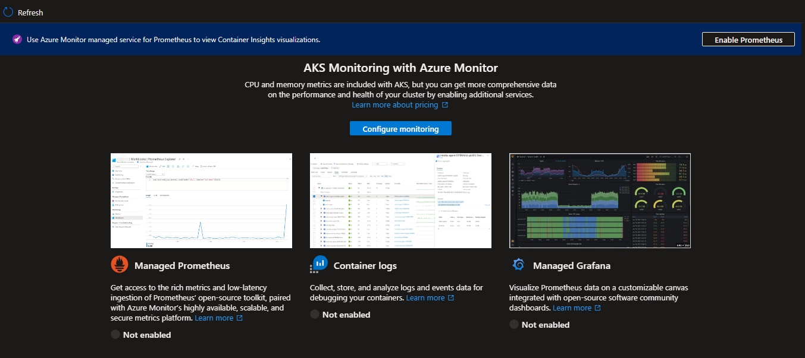
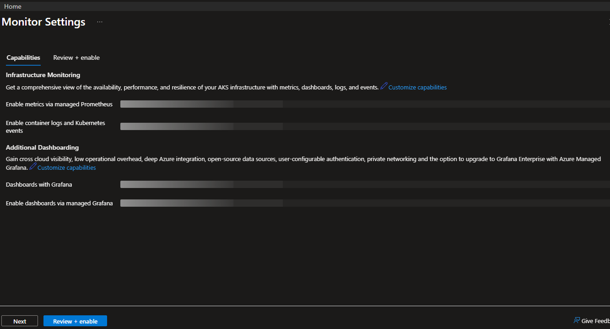
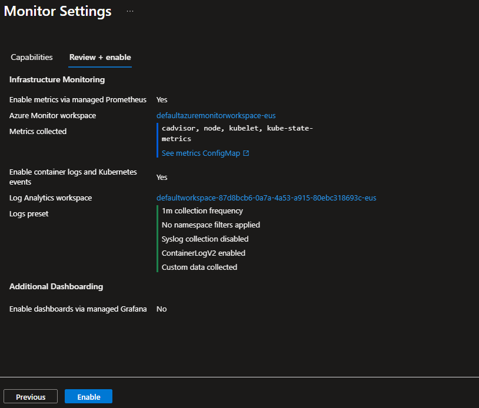
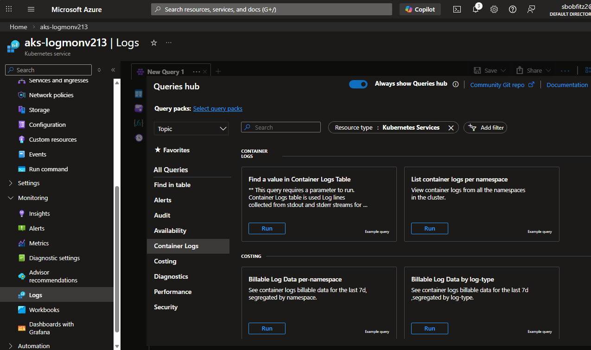
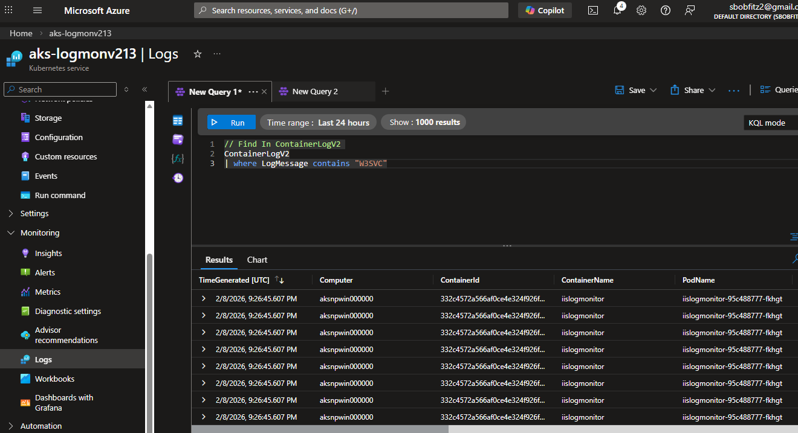

# Setup Guide

## Prerequisites

- The following tools:
  - [_Docker desktop_](https://docs.docker.com/desktop/install/windows-install/)
  - [_Azure CLI_](https://learn.microsoft.com/en-us/cli/azure/install-azure-cli-windows?tabs=azure-cli)
  - Azure subscription with a few credits

### Build the images

- Change into the example folder (one-line or step-by-step):

```powershell
cd .\examples\aks\iis-logmonitor
```

- Build the Docker image from the Dockerfile in this folder, tag it for Docker Hub, and push:

```powershell
# build (run from examples/aks/iis-logmonitor)
docker build -t <dockerhub-username>/iis-logmonitor:latest -f Dockerfile .

# login to Docker Hub (interactive)
docker login

# push
docker push <dockerhub-username>/iis-logmonitor:latest
```

### Create AKS Cluster

> _Run all this from Powershell_

- `az login` (if you have multiple subscriptions, make sure you have the right subscription set as default.)
- cd into `ps-scripts`
- Update `vars.txt`
- Run `./rg-create.ps1` to create the resource group.
- Run `./aks-create.ps1` - the script creates an AKS cluster, adds a Windows node pool and connects to the cluster.

### Deploy the application

```powershell
./deploy.ps1
```

After a few minutes, check the status of the pods
```powershell
kubectl get pods
NAME                            READY   STATUS    RESTARTS   AGE
iislogmonitor-95c488777-fkhgt   1/1     Running   0          2m5s
```
This indicates the pod started successfully — `READY 1/1` and `STATUS Running` show the container is healthy.

Check the service status and external IP, you should get something similar to:

```powershell
# NAME            TYPE           CLUSTER-IP    EXTERNAL-IP     PORT(S)        AGE
# kubernetes      ClusterIP      10.0.0.1      <none>          443/TCP        36m
# iislogmonitor   LoadBalancer   10.0.191.38   52.188.177.226  80:31349/TCP   2m19s
```

Access the app using the `http://EXTERNAL-IP` shown in the output, for example:`http://52.188.177.226`

```powershell
Start-Process "http://52.188.177.226"
```
To stream the container logs from that pod, run:

```powershell
kubectl logs -f iislogmonitor-95c488777-fkhgt
```

### Configure Azure Monitor (Container Insights)

You can enable AKS monitoring (Container Insights) from the Azure portal. Open the following onboarding view and follow the steps to enable monitoring for this cluster (select or create a Log Analytics workspace, then enable):

After onboarding completes you can view container logs, metrics and insights in Azure Monitor > Container insights for the cluster.

To query container logs (Log Analytics) for IIS entries you can run a KQL query in the Log Analytics `Logs` view. Example:

```kql
// Find In ContainerLogV2
ContainerLogV2
| where LogMessage contains "W3SVC"
```

This returns container log entries that include IIS/W3SVC messages collected by Container Insights.

The screenshots below show the Azure Monitor onboarding and Log Analytics views for this example.











### Clean-up

Clean up by deleting the resource group, in `ps-scripts`, run: `./clean-up.ps1`
